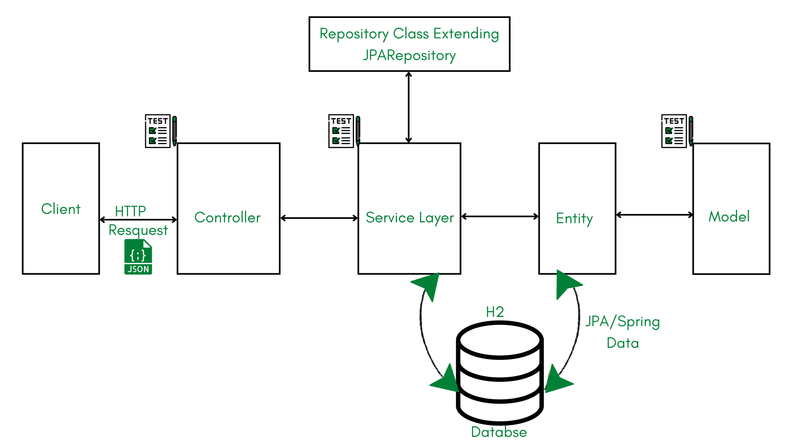
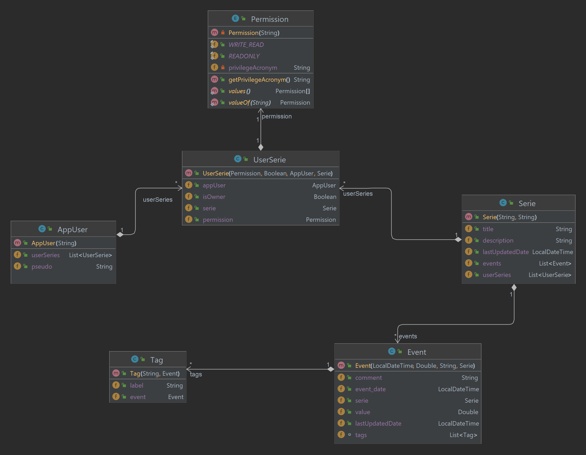

# Rapport TP Techno Web 2022/2023
`Binôme: GUEYE Serigne Saliou & DIALLO Ismael`

## Table of contents
### I. [Démarrage de l'application](#commands)  
### II. [Architecture générale](#architecture)  
### III. [UML et Modèle de données](#uml)  
### IV. [Gestion des ressources](#ressources)

<div style="page-break-after: always"></div>

## I. Démarrage de l'application <a name ="commands"></a>
Cette application utilise le framework [Spring Boot](https://spring.io/projects/spring-boot) avec [maven](https://maven.apache.org/) comme environnemnt d'exécution/compilation.  
Vous pouvez lancer l'application automatiquement sans ligne de commande si vous utilisez un éditeur de texte comme `IntelliJ`.  
Sinon, vous pouvez utiliser les lignes de commandes.  
- Pour lancer l'application :
  ```shell
  $ ./mvnw spring-boot:run
  ```
- Pour lancer les tests
  ```shell
  $ ./mvnw test
  ```
## II. Architecture générale <a name ="architecture"></a>
  
<div style="page-break-after: always"></div>

## III. UML et Modèle de données <a name ="uml"></a>
### 1. UML
  Nous nous sommes basé sur les spécifications fonctionnelles pour créer cet UML:
  
  
### 2. Modèle de données
#### Compraison Mapping unidirectionnel `@ManyToOne` et Mapping bidirectionnel `@OneToMany` et `@ManyToOne`:
Chacun des deux, a des avantages et des inconvénients :
- Le *mapping unidirectionnel* avec `@ManyToOne`, peut éviter le problème de performance potentiel d'un `@OneToMany`. <br>Mais il ne peut pas naviguer ou cascader les opérations CRUD vers les collections enfants vers la collection de base. Cependant, cela peut être fait manuellement.
- Le *mappage bidirectionnel* avec `@OneToMany` et `@ManyToOne` peut permettre aux deux entités de la relation d'accéder rapidement et de réaliser des opérations CRUD en cascade. <br>Cependant, cela peut causer un problème de performance sur une grande collection d'enfants.

Selon ces deux comparaisons, nous avons décidé d'utiliser le *mapping unidirectionnel*, car nous préférons éviter les problèmes de performance. Et pour la cascade, nous allons la faire manuellement.

## IV. Gestion des ressources <a name ="ressources"></a>
Pour l'API, nous avons utilisé REST avec les méthodes `GET`, `POST`, `PUT`, et `DELETE`.
### 1. Pour gérer les utilisateurs (Création, Affichage) 
- Pour afficher tous les utilisateurs
```http request
GET http://localhost:8080/api/users
```
- Pour afficher un utilisateur (en se basant sur son pseudo)
```http request
GET http://localhost:8080/api/users/{{pseudo}}
```
- Pour créer un utilisateur
```http request
POST http://localhost:8080/api/users/add
```
- Pour créer un utilisateur
```http request
POST http://localhost:8080/api/users/add
```
### 2. Pour gérer les séries (Création, Affichage, Partage, Modification et Suppression)
- Pour afficher toutes les séries d'un utilisateur, ainsi que leur mode de partage.
```http request
GET http://localhost:8080/api/user_series/{{pseudo}}
```
- Pour afficher une série d'un utilisateur ainsi que son mode de partage
```http request
GET http://localhost:8080/api/user_series/{{pseudo}}/{{serie_id}}
```
- Pour créer une série. Cette série sera affectée à l'utilisateur qui l'a créé
```http request
POST http://localhost:8080/api/user_series/add/{{pseudo}}
```
- Pour partager une série à un utilisateur (ici `pseudoOwner` partage la série à `pseudoReceiver` avec le mode de partage souhaité -> Soit `READONLY` ou `WRITE_READ`)
```http request
POST http://localhost:8080/api/user_series/share/{{serie_id}}/{{pseudoOwner}}/{{pseudoReceiver}}?permission={{permission}}
```
- Pour modifier une série
```http request
PUT http://localhost:8080/api/user_series/update/{{serie_id}}/{{pseudo}}
```
- Pour supprimer une série
```http request
DELETE http://localhost:8080/api/user_series/delete/{{serie_id}}/{{pseudo}}
```